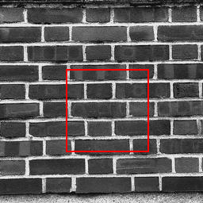
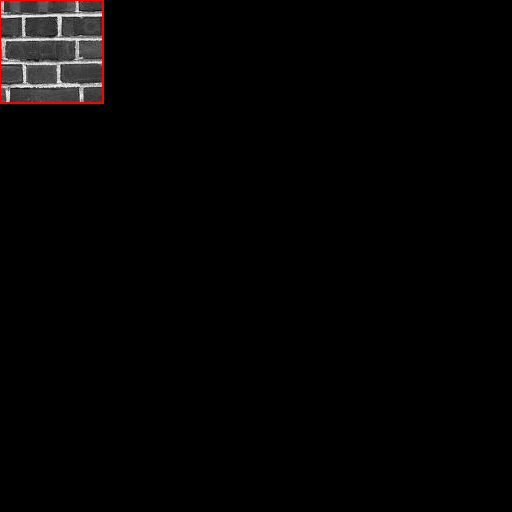
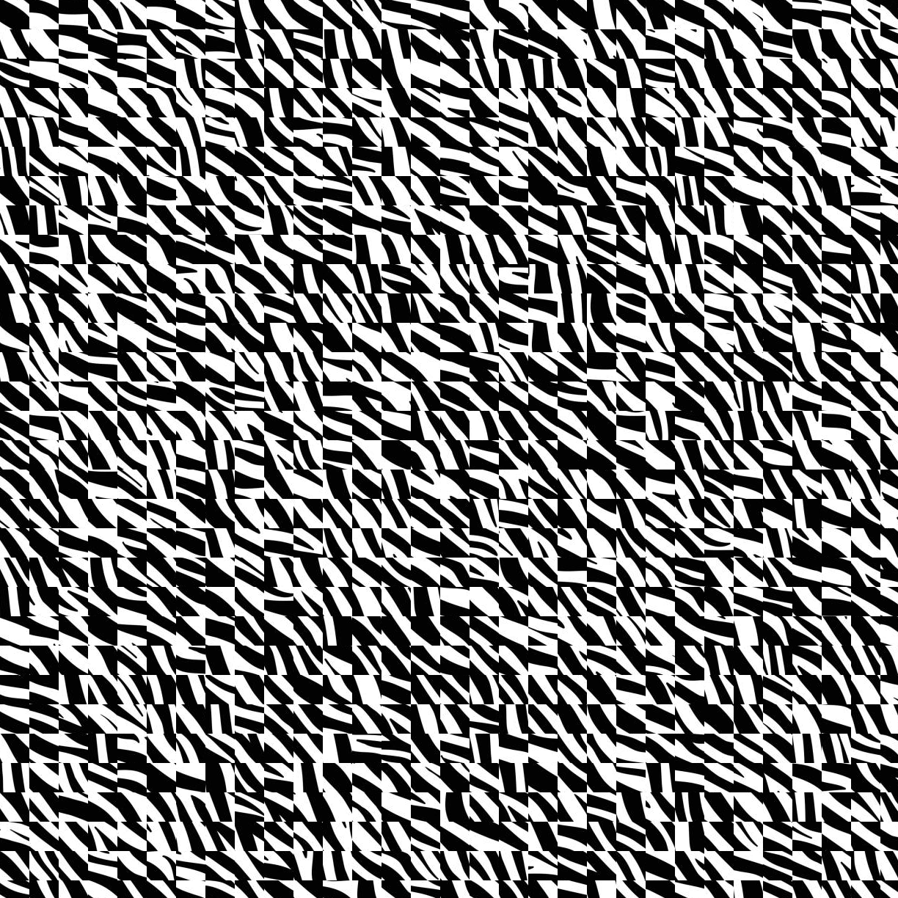
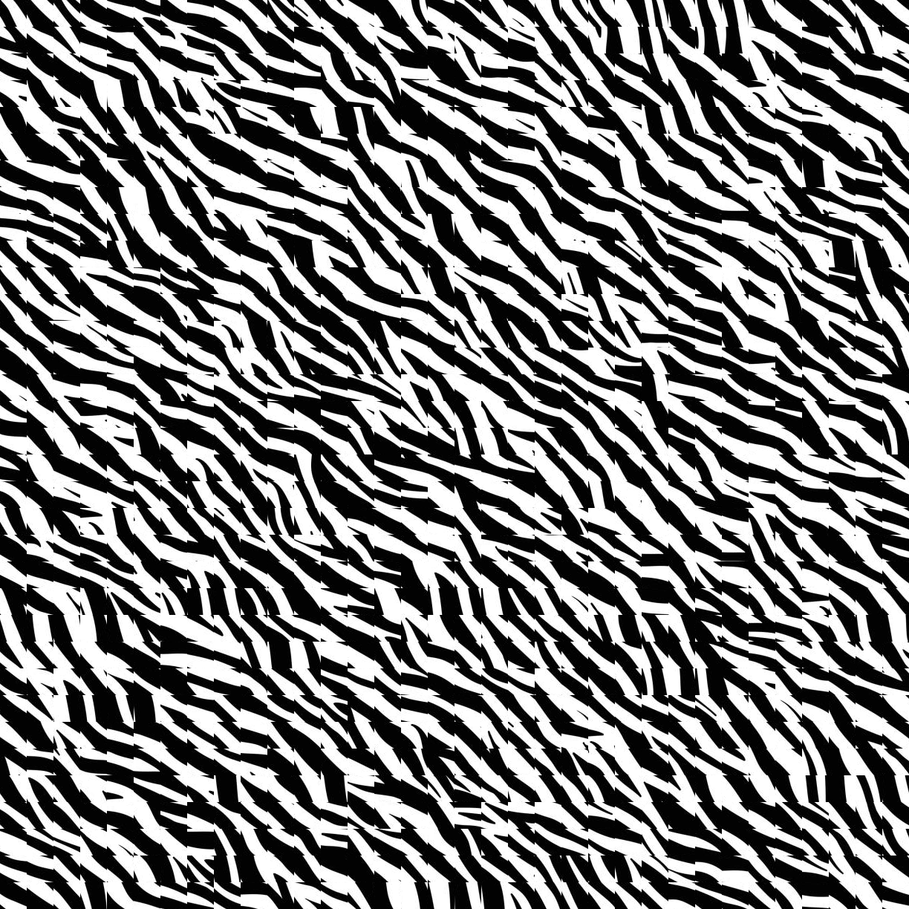
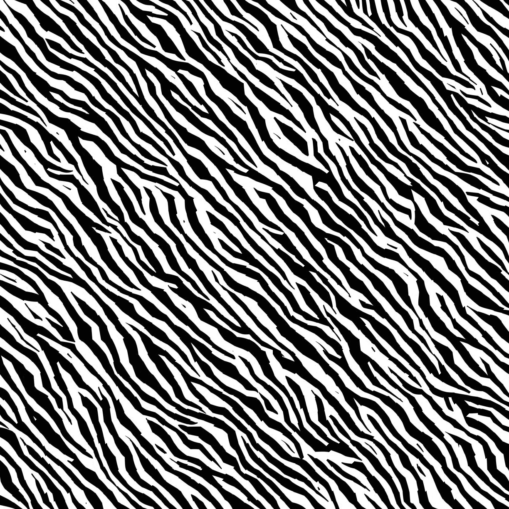
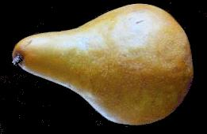
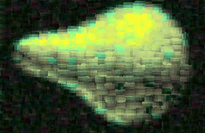

# Image Quilting & Texture Transfer (Efros & Freeman Project)

This project is a university computer vision assignment implementing classical texture synthesis and texture transfer methods.

It is based on the work of:

Efros & Freeman (2001) – Image Quilting for Texture Synthesis and Transfer
Reference : https://graphics.cs.cmu.edu/people/efros/research/quilting.html

<p align="center">
  
  
</p>

---

# 📌 Project Overview

The goal of this project is to implement and compare different patch-based texture synthesis techniques:

- Random placement (baseline)
- Overlap-based quilting
- Seam cut quilting (minimum error boundary cut)
- Texture transfer (guided synthesis)

Each method progressively improves visual coherence and realism.

All implementations are written from scratch using NumPy + Pillow, without deep learning.

---

# ⚙️ Installation

> ```bash
> pip install numpy pillow opencv-python
> ```

---

# 🚀 How to Run

Each method is independent and can be executed separately.

---

# 🧪 1. Random Placement (Baseline)

📌 Description
Random patch sampling from a texture image. No overlap consistency → fast but visually noisy result.

## 🖼️ Example

<p align="center">
  
</p>

▶️ Run:

> ```bash
> python src/random_placement.py --src data/source_images/zebra.jpg --patch 10 --multiply 2
> ```

---

# 🧪 2. Overlap Quilting

📌 Description
Improves random placement by enforcing overlap consistency between adjacent patches using SSD.

## 🖼️ Example

<p align="center">
  
</p>

▶️ Run:

> ```bash
> python src/overlap_quilting.py --src data/source_images/brick.jpg --patch 5 --overlap 20 --multiply 2
> ```

---

# 🧪 3. Seam Cut Quilting

📌 Description
Uses minimum error boundary cut (dynamic programming) to reduce visible seams.

## 🖼️ Examples

<p align="center">
  
</p>

▶️ Run:

> ```bash
> python src/seam_cut_quilting.py --src data/source_images/zebra.jpg --patch 10 --overlap 30 --multiply 2
> ```

---

# 🧪 4. Texture Transfer

📌 Description
Transfers a texture onto a target image while preserving structure.

Balances:

- texture coherence
- structural similarity

## 🖼️ Example

From these images:

<p align="center">
  
  
</p>

to this result:

<p align="center">
  
</p>
▶️ Run:

> ```bash
> python src/texture_transfer.py --src data/target_images/face.jpg --dest data/source_images/rice.jpg --patch 15 --overlap 30 --multiply 2 --iter 4 --cut
> ```

---

# 📊 Parameters

--src: Source texture image
--dest: Target image (texture transfer only)
--patch: Number of patches per dimension
--overlap: Overlap percentage
--multiply: Output scaling factor
--iter: Number of iterations (transfer only)
--cut: Enable seam visualization

---

# 📁 Outputs

All results are saved in:

results/

Organized by method:

- results/random_placement/
- results/overlap_quilting/
- results/seam_cut_quilting/
- results/texture_transfer/

---

# 🧠 Key Concepts Implemented

- Patch-based synthesis
- SSD (Sum of Squared Differences)
- Overlap matching
- Dynamic programming seam optimization
- Guided texture transfer

---

# 📚 Reference

Efros & Freeman (2001)
Image Quilting for Texture Synthesis and Transfer

## Paper : https://graphics.cs.cmu.edu/people/efros/research/quilting/quilting.pdf

# 🎓 Academic Context

University-level computer vision project demonstrating classical image synthesis techniques without machine learning.

---

# 📌 Notes

- Implemented from scratch (NumPy + Pillow + OpenCV only)
- No deep learning used
- Focus on algorithmic understanding
